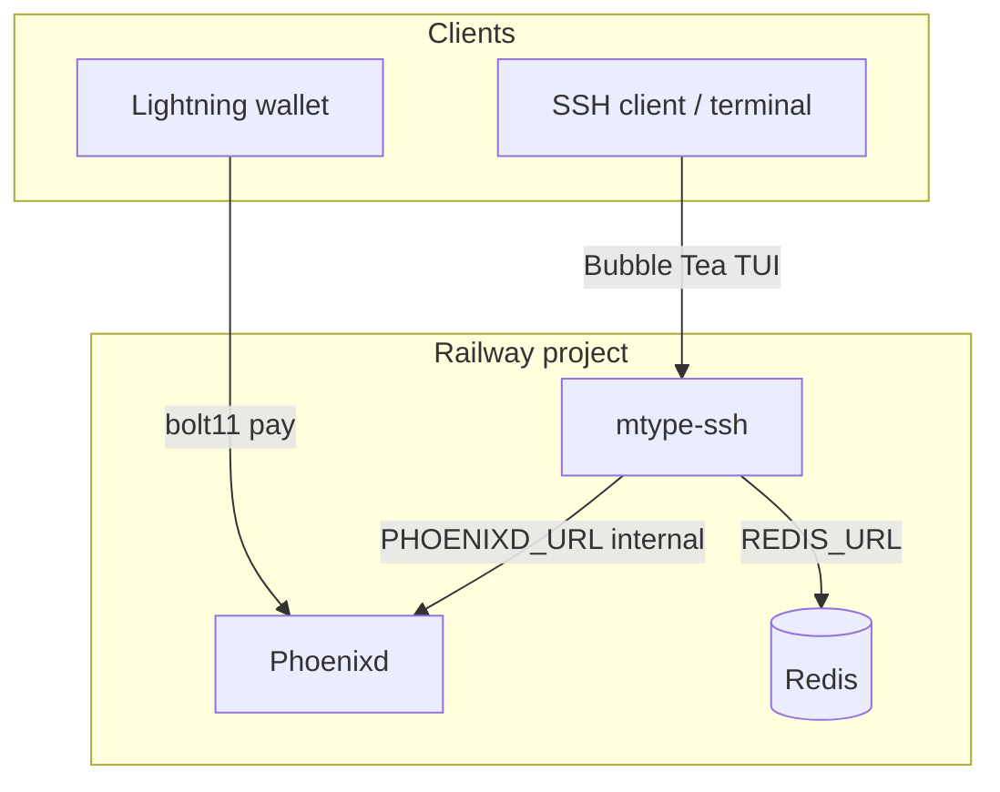
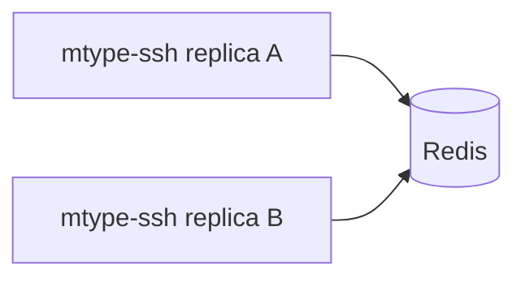

# gotype architecture

SSH typing races with Player progression, a Lightning shop, and optional tips. Live at [gotype.fun](https://gotype.fun) (`play@game.gotype.fun`).

## System overview



Each SSH session gets its own Bubble Tea program. `gotype-ssh` replicas are **stateless**: they hold only Redis clients, not Player or lobby data. `App` and `Hub` read/write Redis on every operation so you can scale `mtype-ssh` horizontally when `REDIS_URL` is set.



## Binaries

| Binary | Role |
|--------|------|
| `cmd/gotype-ssh` | Production: Wish SSH server + HTTP landing + shared progression |
| `cmd/gotype` | Local TUI without SSH |

## Layers

```
cmd/gotype-ssh
  └── internal/ui          Bubble Tea model, screens, input
        ├── internal/game  Race engine, Three-Strike, WPM/accuracy
        ├── internal/multi Redis-backed matchmaking hub
        ├── internal/player   Register / claim / session / wallet login
        ├── internal/lnauth   LNURL-auth challenges (LUD-04)
        ├── internal/progress XP, Season Pass, rewards
        ├── internal/shop     Buy orders + Lightning invoicing
        ├── internal/persist  Player data store
        ├── internal/ln       Tip invoices (Phoenixd or LNURL-pay)
        └── internal/catalog  SKU / season track definitions
```

### UI (`internal/ui`)

- **Model** drives phases: menu → race → result → progression (inventory, shop, claim).
- **App** wires persistence and domain services once per process (`OpenApp`).
- SSH entry passes `Options.App`, `Options.Hub`, and a per-session `SessionID` into the model.

### Game (`internal/game`)

- Solo and multiplayer sessions share the same engine.
- Multi races use `NoAutoFinish`; the hub ends the race on a shared clock.
- **Three-Strike** (lobby label: hardcore) is opt-in casual mode with HP and Heart consumables.

### Multiplayer (`internal/multi`)

- Hub rooms stored in Redis when `REDIS_URL` is set (`gotype:hub:room:{code}` + room index set).
- Per-room optimistic locking (`WATCH` / retry) so concurrent updates from multiple replicas stay consistent.
- Without `REDIS_URL`, hub falls back to in-memory maps (local dev / tests only).

### Progression

| Package | Responsibility |
|---------|----------------|
| `internal/player` | Register, claim code verify, wallet linking key, active session, rename |
| `internal/progress` | XP grants, daily soft cap, Season Pass tier claims |
| `internal/shop` | Buy flow: Order state machine → invoice → poll → grant |
| `internal/catalog` | Static SKU list, season track tiers, prices |

## Persistence

Player-facing state is a single JSON document:

- **Production:** Redis key `gotype:data` via `REDIS_URL`
- **Local dev:** file at `GOTYPE_DATA_DIR/data.json`, or OS temp if unset

Backend is pluggable (`fileStorage` / `redisStorage`).

**Redis mode (production):** no in-process document cache. Each `Store` method loads the JSON blob, mutates, and saves inside a Redis `WATCH` transaction (retries on conflict). Safe across replicas.

**File mode (local dev):** in-memory cache + `sync.Mutex`; unchanged behavior for tests.

### Redis keys

| Key | Purpose |
|-----|---------|
| `gotype:data` | Player progression document (override prefix via `GOTYPE_REDIS_KEY`) |
| `gotype:hub:rooms` | Set of active room codes |
| `gotype:hub:room:{code}` | Room JSON blob |
| `gotype:ratelimit:{key}` | Register/claim rate-limit windows |
| `gotype:lnauth:k1:{k1}` | LNURL-auth challenge (5 min TTL) |

### Player identity

Players persist progression via **Login** (LNURL-auth wallet scan). SSH access stays open; identity is logged in inside the TUI.

| Flow | Mechanism |
|------|-----------|
| Login | Scan LNURL QR with a Lightning wallet → wallet signs challenge → display name (new) or auto-login (returning) |

Suggested wallets: Wallet of Satoshi, Phoenix, Zeus, Breez, Alby, Blink.

HTTP endpoints (when `GOTYPE_PUBLIC_URL` is set): `GET /auth/lnurl` (wallet callback), `GET /auth/lnurl/status` (TUI poll).

### Entities in the document

| Collection | Key pattern | Examples |
|------------|-------------|----------|
| Players | `players[id]`, `by_name[name_key]` | identity, claim hash, session |
| Inventory | `playerID\|sku` | consumable qty, owned cosmetics |
| Equipment | `playerID\|slot` | theme, caret, title, fx |
| Seasons | `seasons[id]` | window, track ref |
| Season progress | `playerID\|seasonID` | XP, premium, claimed tiers |
| Orders | `orders[id]` | shop Buy lifecycle |
| Daily XP | `playerID\|YYYY-MM-DD` | soft cap tracking |

Writes are atomic within one Redis transaction. Multi-key updates (e.g. `GrantPaidOrder`, `ApplyRewardClaims`) stay consistent on a single replica; cross-replica conflicts retry via `WATCH`.

Optional: `GOTYPE_REDIS_KEY` overrides the key prefix (default `gotype`).

## Lightning

Non-custodial **Tip** and **Buy** only — no in-TUI wallet.

| Flow | Backend | Mechanism |
|------|---------|-----------|
| **Tip** | Phoenixd (preferred) or LNURL-pay | BOLT11 invoice + QR |
| **Buy** | Phoenixd (preferred) or LNBits | BOLT11 invoice + poll `GET /payments/incoming/{hash}` |

When `PHOENIXD_URL` + `PHOENIXD_PASSWORD` are set, both tip and shop use the same Phoenixd node. Shop grants fire after payment is observed paid.

Phoenixd runs as a separate Railway service with a persistent volume for its seed. Inbound Lightning requires channel liquidity (on-chain swap-in or pay-to-open bootstrap).

## Railway topology

| Service | Purpose |
|---------|---------|
| **mtype-ssh** | Stateless app: SSH + HTTP; scale replicas when `REDIS_URL` is set |
| **Redis** | Managed database; `REDIS_URL` referenced into mtype-ssh |
| **Phoenixd** | Lightning receive node; `PHOENIXD_URL=http://phoenixd.railway.internal:9740` |

Deploy: `railway.toml` → root `Dockerfile` builds `gotype-ssh`. Phoenixd uses `deploy/phoenixd/Dockerfile`.

## Environment variables

### Persistence

| Variable | Required | Description |
|----------|----------|-------------|
| `REDIS_URL` | prod | Redis connection string (preferred in production) |
| `GOTYPE_DATA_DIR` | dev | JSON file path or directory for local fallback |
| `GOTYPE_REDIS_KEY` | no | Redis document key (default `gotype:data`) |

### Lightning

| Variable | Description |
|----------|-------------|
| `PHOENIXD_URL` | Phoenixd HTTP base URL |
| `PHOENIXD_PASSWORD` / `PHOENIXD_API_PASSWORD` | HTTP Basic auth password |
| `TIP_LIGHTNING_ADDRESS` / `TIP_LNURL` | Fallback tip destination if Phoenixd unset |

### Auth / deploy

| Variable | Description |
|----------|-------------|
| `GOTYPE_PUBLIC_URL` | Public HTTPS base for LNURL-auth callbacks (e.g. `https://gotype.fun`) |

### SSH / deploy

| Variable | Description |
|----------|-------------|
| `SSH_PORT` | SSH listen port (default `2222`) |
| `PORT` | HTTP landing port (default `8080`) |
| `SSH_HOST_KEY` | PEM host key (else generated under temp) |
| `SSH_HOST_FINGERPRINT` | Displayed invite fingerprint |

## Domain language

Product terms (Player, Login, Buy, Order, Season Pass, etc.) are defined in [CONTEXT.md](./CONTEXT.md). Use that vocabulary in code comments, UI copy, and docs.

## Related docs

- [CONTEXT.md](./CONTEXT.md) — ubiquitous language
- [docs/prd/gamify-lightning.md](./docs/prd/gamify-lightning.md) — progression + shop PRD
- [docs/agents/domain.md](./docs/agents/domain.md) — agent context pointers
